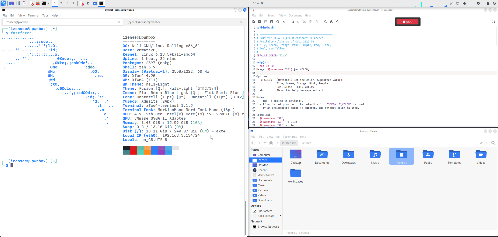

# Kali Linux XFCE Theme Switcher

A simple script to **switch** between **dark** and **light** **themes** in the **Kali Linux XFCE** desktop environment.



## Features

- Toggle between dark and light XFCE themes in Kali Linux
- Supports multiple accent colors
- Keyboard shortcut friendly
- Lightweight and dependency-free

## Compatibility

- Kali Linux XFCE (tested on 2025.04)
- May work on other XFCE-based distributions with Kali themes installed

## Installation

```bash
# make a private bin directory if it doesn't exist
mkdir -p ~/.local/bin
curl -fsSL https://raw.githubusercontent.com/izensec/kali-xfce-theme-switcher/main/theme-switcher.sh -o ~/.local/bin/theme-switcher.sh
chmod +x ~/.local/bin/theme-switcher.sh
```

## Usage

You can run it using two options:
- A keyboard shortcut
- The command line directly

You can choose one option or use both.

### Option 1: Keyboard shortcut

Handy if you just want to **toggle** the **light/dark** mode with the **default color**.

Steps:
- `Settings Manager` → `Keyboard`
- Select the `Application Shortcuts` tab → click `Add`
- Add the full path to the script, e.g. `/home/<username>/.local/bin/theme-switcher.sh`
- Assign a shortcut, e.g. `Shift + Super + T`

That's it!

### Option 2: Command line

On Kali Linux, `~/.local/bin` is in your `PATH` by default, so you can call the script directly:

```bash
# Toggle dark/light theme using default color
theme-switcher.sh

# Toggle dark/light theme using a supported color
theme-switcher.sh -c Purple
```

## Change the default theme color

If you want to change the default color, modify the constant `DEFAULT_COLOR` in the script to one of the available colors. As of Kali Linux 2025.04, the available colors are:
- Blue
- Green
- Orange
- Pink
- Purple
- Red
- Slate
- Teal
- Yellow

## Limitations

With the default **QTerminal**, theme color changes are not applied immediately.
You must restart the terminal for the new colors to take effect. 

A **better option** would be to **use** the `XFCE terminal` instead. 
You can install it with `sudo apt install xfce4-terminal`, then configure it to be your default terminal.

## Manual

```less
Usage: theme-switcher.sh [-c COLOR]

Options:
  -c COLOR   (Optional) Set the color. Supported values:
             Blue, Green, Orange, Pink, Purple,
             Red, Slate, Teal, Yellow
  -h         Show this help message and exit

Notes:
  - The -c option is optional.
  - If -c is not provided, the default color "Blue" is used.
  - If an unsupported color is entered, the default color is used.

Examples:
  theme-switcher.sh
  theme-switcher.sh -c Purple
  theme-switcher.sh -c Red
```